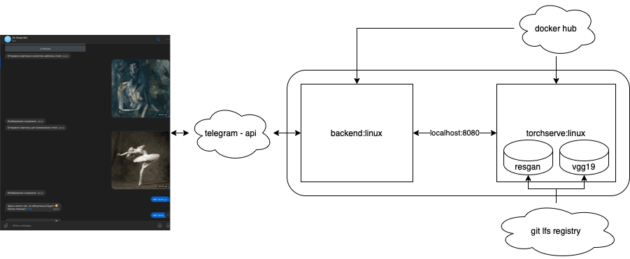

# Telegram image style swapper

Это асинхронный бот https://t.me/im_swap_bot обрабатывающий картинки нейронными сетями, сделаный https://t.me/irusland (https://stepik.org/users/45922671), специально для https://www.dlschool.org!

# [Видео демонстрация](https://youtu.be/IZ93KVPcAVE)

# Схема
Бот состоит из 2ух частей - контейнеров запущенных в докере, на вм 4c4r в yandex cloud

1) бэк для взаимодействия с фронтэнд api telegram

2) бэк для нейросетей на torchserve



Написан на основе библиотеки aiogram, и работает для нескольких клиентов одновременно 

Выделен базовый имадж с библиотеками для быстрой загрузки имаджей в реджистри.

Запущен на виртуалке yandex cloud, вычисления производит на cpu поэтому придется подождать :) 

Бэкэнд аснхронный, поэтому можно писать и работать с ботом во время того, 
как он ждет результат манипуляций с картинками


## Функции
Реализованы интересные команды, просмотр которых можно вызвать командой /help

* /start - показать стартовое сообщение
* /image - доступные нейросети
* /cancel - отменить и выйти на главный экран
* /admin - панель админа
* /settings - панель настроек
* /help - показать это сообщение

### Выбор языка
Можно выбирать язык, настройка сохранится для конкретного пользователя


### Перенос стиля на фото
Необходимо использовать команду /image и выбрать ImSwapNeuralNet. 
По итогу получится фотография с перенесенными стилем

Работает на итеративном алгоритме с матрицами Грамма и vgg19

[Ссылка на статью](https://pytorch.org/tutorials/advanced/neural_style_tutorial.html)

### Улучшение качества фото
Необходимо использовать команду /image и выбрать ImSwapNeuralNet. 
По итогу получится фотография с перенесенными стилем

Работает с помощью RealESRGAN

[Ссылка на статью](https://arxiv.org/abs/2107.10833) 

### Логи
Пишутся в stdout и в файл для дебага проблем.


## Установка
Для установки понадобятся python3.10, poetry, docker, docker-compose, git-lfs, 

При проблемах - писать в tg @irusland

```bash
make install
```

## Геренация архивов моделей .mar
Запустить `archive.sh` в директории `models_backend`

либо скачать готовые
```bash
git lfs pull --include "*.mar"
```

## Запуск
### в докере 
```bash
make build
make run
```
### С помощью docker-compose
```bash
make up
```
### Локально в терминале
в первом окне
```bash
make start
```
во втором окне
```bash
make serve
```

# Ссылки

[Мой telegram](https://t.me/irusland)

[Мой stepik](https://stepik.org/users/45922671)
